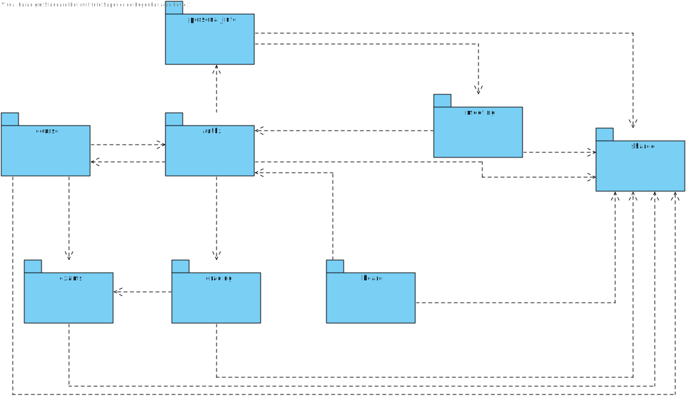
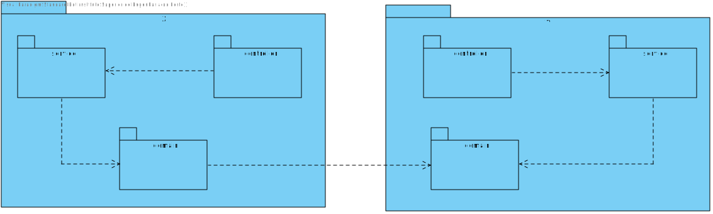

# 📝 Domain Driven Design - DDD

## Domain View

### Orthogonal View

 *Fig.1 - Domain Driven Design in orthogonal prespective*

### Free Form View

 *Fig.2 - Domain Driven Design in free form prespective*

### Notes
**Note 1**: Both are the same DDD diagram, they only differ in linetype. 

**Note 2**: Id's were ommited from the DDD where they were not relevant for the problem at hands, however, this not means that any entity will not have
an Id. That is incorrect. Simply, the Id implementation will be left to the moment implementation. 
Probably all entities will share an Id format like UUID or Long. In sumattion,**Ids were ommited, not 
ignored**. 

**Note 3**: There were considered extra functionalities that were not requested in the MVP requirements,
however, this diagram is supose to "predict" the future, where possible further changes may occur.
It is not that changes may not occur, is that changes would be minimal.

**Note 4**: Although this diagram is segregated by aggregates, the implemantation of each aggregate may
bennifit from shared domain (i.e Having a shared package where shared *Value Objects*. e.g Title)

## Implementation View

### General View

### Detailed View

**Note**: The X and Y represent the packages in the general view (i.e X is course and Y is exams).
The communication between packages is always at the domain level.

