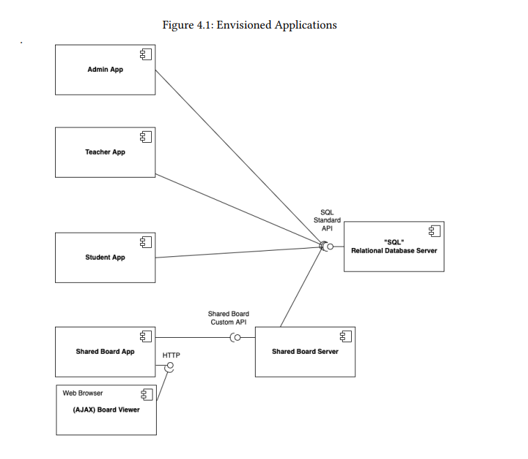

# 🎯 MVP - Overview

## 📝 Context

**Learning Systems (LS)** requested the conceptualization and creation of a solution capable of allowing several users to connect to a remote
learning plataform. The platform, must, at least, be capable of providing the following services:

* **Automated Exams** - Exams that are concieved by professors. To create an exam, the professor must use a costume DSL to be created. The
students must be capable of take the exams and be score automatically by the system. The application must be capable of creating
dashboards about student´s statistics.
* **Shared Boards** - Boards must be capable of sharing information, in an organized way, between the professor and their students.

## ✔️ Requirements

### 🛠️ Functional Requirements

### 📚 Non-functional Requirements

## 💡 Application Logical Overview

