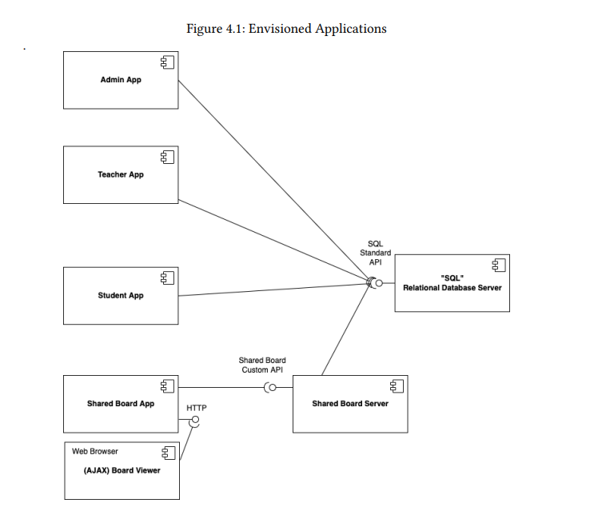

# 🖧 Application : Modules, Systems and Implementation

## 🖥️ Systems

As presented in the [MVP - Overview](../Overview/MVP%20-%20Overview.md), the following diagram will represent
the diverse systems to develop.

The Admin, Teacher and Student app will be very similar, even though their frontend and use cases
are clearly distinct, their backend logic is shared, due to their similarities.
As a consequence of that, although is not represented in the diagram, those three apps will make use of
a single and shared backend that implements the domain design explicit in [Domain Driven Design - DDD](../DDD/DDD.md).
Entering in more detail on the frontend of said apps, they will be done in console, in a way, just
to prove that the concept works and makes sense.

The Shared Board Server (SBS) will also share a portion of the said backend, however, it will predominally
will make use of the Authz and Shared Board side of the buiseness.
In addition to that, the Shared Board App (SBA) and SBS will make use of the 
Client-Server Model of operating. The boards will be stored in the SBS, reating to 
events sent by the SBA of each client. 

An extreme attention to multithreaded programming must be paid
in order to make this model working with less conflict of domain alteration, and client connection issues.
A possible solution to such problems are, in the first case, the synchronization of the domain, preventing
entities from being manipulated by two users at the same time, having a Queue of actions;
in the second case, a confirmation based protocol is ideal for this situations,
the client can send the information and wait from the server's response. If the time runs out, the packet will
be resent and waits for confirmation again, until a threshold is met, making attention to the user
about their connection issues, on the client side, however, on the server side, when reciving
the client's request the server will sent the confirmation and if the user sends multiple packets with the same information,
the server will confirm the action but not take ation, to avoid redundancy; this packet verification can be
achieved with packet IDs.

## 🗃️ Implementation

## ➡️ Behaviour

### General behaviour of UC

### 

